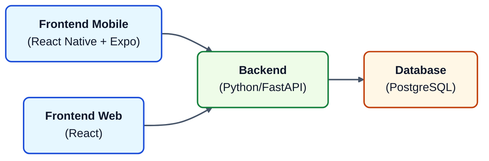

# cat-health-interface
CHI = Cat Health Interface

A cat health tracking app for helping owners stay on top of their cat's care. Log your pet's habits, such as feedings, weight and fecal data.

## Architecture

The backend is deployed on AWS, and PostgreSQL is hosted on AWS RDS.

## Development

1. Start the Python backend locally. See `backend/README.md` for details.
2. Start either the web frontend `frontend-web/README.md` or mobile frontend `frontend-mobile/README.md` locally
